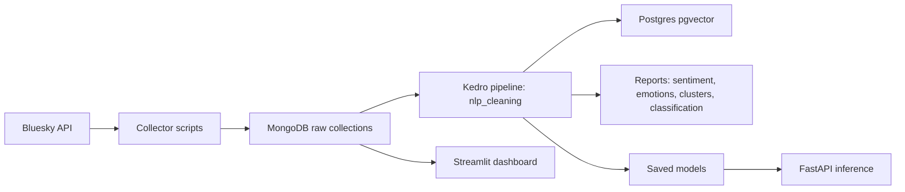

# Projet Thumalien - Documentation Technique (Version Markdown)

This document explains what the project does, how it works, and why each major design choice exists. It also maps the current implementation to the requirements from the cahier des charges and highlights what remains to complete for the MVP.

## 1. Executive summary

Goal: detect misinformation on Bluesky with a pipeline that collects posts, cleans and enriches them, trains baseline models, and produces interpretable outputs (scores, clusters, and reports). The current implementation covers data collection, MongoDB storage, NLP cleaning, TF-IDF embeddings, baseline classification, clustering, reporting outputs, dashboarding, API exposure, and monitoring hooks. The current remaining gap is mainly data quality: the project now has a curated credible reference set, but not a perfect manually verified fake-news ground-truth dataset.

## 2. Architecture overview

High-level flow:

Key components:
1. Data collection scripts in [src/getBlueskyFeed.py](/C:/Users/lunel/OneDrive%20-%20SUP%20DE%20VINCI/Documents/Mast%C3%A8re1/Projet_d_etude_G7/src/getBlueskyFeed.py) and [src/getBlueskySearch.py](/C:/Users/lunel/OneDrive%20-%20SUP%20DE%20VINCI/Documents/Mast%C3%A8re1/Projet_d_etude_G7/src/getBlueskySearch.py)
2. Storage in MongoDB (raw posts and cleaned posts)
3. Kedro pipeline in [bluesky-pipeline/src/bluesky_pipeline/pipelines/nlp_cleaning](/C:/Users/lunel/OneDrive%20-%20SUP%20DE%20VINCI/Documents/Mast%C3%A8re1/Projet_d_etude_G7/bluesky-pipeline/src/bluesky_pipeline/pipelines/nlp_cleaning)
4. Optional orchestration with Airflow in [airflow/dags/blueskyToMongo.py](/C:/Users/lunel/OneDrive%20-%20SUP%20DE%20VINCI/Documents/Mast%C3%A8re1/Projet_d_etude_G7/airflow/dags/blueskyToMongo.py)

## 3. Data collection (Bluesky API)

### 3.1 Authentication
File: [src/getBlueskyFeed.py](/C:/Users/lunel/OneDrive%20-%20SUP%20DE%20VINCI/Documents/Mast%C3%A8re1/Projet_d_etude_G7/src/getBlueskyFeed.py)

`load_token()` calls the Bluesky XRPC endpoint `com.atproto.server.createSession` with the identifier/password from `.env`. The returned `accessJwt` is used as the Bearer token for all subsequent calls. This keeps the authentication logic isolated and reusable across feed and search functions.

### 3.2 Feed collection
File: [src/getBlueskyFeed.py](/C:/Users/lunel/OneDrive%20-%20SUP%20DE%20VINCI/Documents/Mast%C3%A8re1/Projet_d_etude_G7/src/getBlueskyFeed.py)

`fetch_feed_paginated()` wraps `app.bsky.feed.getFeed` with:
1. Cursor-based pagination
2. Rate limit handling (HTTP 429)
3. Early stop if no new posts

Specific feeds are defined as helper functions:
- `get_hot_feed`
- `get_ukrainian_feed`
- `get_science_feed`

Why this design:
1. Each feed becomes a lightweight function with a stable URI.
2. The pagination logic is centralized and consistent.

### 3.3 Search collection
File: [src/getBlueskySearch.py](/C:/Users/lunel/OneDrive%20-%20SUP%20DE%20VINCI/Documents/Mast%C3%A8re1/Projet_d_etude_G7/src/getBlueskySearch.py)

`search_posts_backfill()` hits `app.bsky.feed.searchPosts` with:
1. Cursor-based pagination
2. Language filtering (`lang` parameter)
3. Backfill logic for older posts

Why search + feed:
1. Feeds provide community-curated content and a stable stream.
2. Search queries provide topic coverage and recall for targeted domains (science, climate, etc.).

### 3.4 Ingestion to MongoDB
Files:
- [src/blueskyToMongoBackfill.py](/C:/Users/lunel/OneDrive%20-%20SUP%20DE%20VINCI/Documents/Mast%C3%A8re1/Projet_d_etude_G7/src/blueskyToMongoBackfill.py)
- [src/insertToMongo.py](/C:/Users/lunel/OneDrive%20-%20SUP%20DE%20VINCI/Documents/Mast%C3%A8re1/Projet_d_etude_G7/src/insertToMongo.py)
- [src/getBlueskyAuthorFeed.py](/C:/Users/lunel/OneDrive%20-%20SUP%20DE%20VINCI/Documents/Mast%C3%A8re1/Projet_d_etude_G7/src/getBlueskyAuthorFeed.py)
- [src/mongoConnect.py](/C:/Users/lunel/OneDrive%20-%20SUP%20DE%20VINCI/Documents/Mast%C3%A8re1/Projet_d_etude_G7/src/mongoConnect.py)

`blueskyToMongoBackfill.py` performs:
1. Topic-based search in EN/FR
2. Insert into MongoDB collections per topic (e.g., `science`, `ukraine`)
3. State tracking in a `search_state` collection to manage cursors and low-activity FR searches
4. Collect trusted publisher posts into `verified_news` using author feeds
5. State tracking per trusted author cursor for efficient backfill
6. Retention policies (optional): delete old data and cap collection size

`insertToMongo.py` handles feed insertion. Each collection uses a unique index on `post.uri` to avoid duplicates.

Why MongoDB:
1. Flexible schema for complex Bluesky post structures
2. Fast ingestion at scale
3. Natural storage for raw (unstructured) data

## 4. Kedro pipeline (NLP + ML)

Pipeline files:
- [bluesky-pipeline/src/bluesky_pipeline/pipelines/nlp_cleaning/pipeline.py](/C:/Users/lunel/OneDrive%20-%20SUP%20DE%20VINCI/Documents/Mast%C3%A8re1/Projet_d_etude_G7/bluesky-pipeline/src/bluesky_pipeline/pipelines/nlp_cleaning/pipeline.py)
- [bluesky-pipeline/src/bluesky_pipeline/pipelines/nlp_cleaning/nodes.py](/C:/Users/lunel/OneDrive%20-%20SUP%20DE%20VINCI/Documents/Mast%C3%A8re1/Projet_d_etude_G7/bluesky-pipeline/src/bluesky_pipeline/pipelines/nlp_cleaning/nodes.py)

Why Kedro:
1. Clear separation into nodes (pure functions)
2. Reproducible data pipelines
3. Easy extension with new steps (emotion, explainability, dashboards, etc.)

### 4.1 Node-by-node explanation

1. `load_raw_posts`
   - Reads from MongoDB collections and adds `source_label` based on collection name.
   - Why: this label is used as a supervised target for baseline classification.

2. `clean_text_node`
   - Lowercase, remove URLs/mentions/hashtags, punctuation, accents, and normalize spaces.
   - Why: reduce noise and standardize text before vectorization.

3. `tokenize_and_lemmatize`
   - Language-aware SpaCy lemmatization (EN/FR).
   - Removes stopwords and non-alpha tokens.
   - Why: normalize tokens and reduce vocabulary size.

4. `remove_duplicates`
   - Removes exact duplicates on `clean_text`.
   - Why: avoid data leakage and over-represented posts.

5. `derive_credibility_labels`
   - Weak supervision rule: `verified_news` -> credible, others -> unverified.
   - Why: provides a baseline fake-news signal when no gold labels exist.

6. `vectorize_posts`
   - TF-IDF with configurable n-grams, stopword removal (EN+FR), and custom stopwords to remove useless tokens.
   - Why: simple, explainable baseline for text classification.

7. `add_sentiment`
   - TextBlob polarity in range [-1, 1].
   - If text is French and `textblob-fr` is installed, a French sentiment analyzer is used.
   - Why: basic affect signal for reporting.

8. `add_emotions`
   - Optional transformer emotion model (multilingual) if enabled.
   - Falls back to NRC Lexicon if transformers are not installed.
   - Emits an explicit warning if emotion extraction dependencies are missing and tags posts with `emotion_status`.
   - Why: fulfills emotion analysis with a lightweight baseline.

9. `compute_sentiment_summary`
   - Aggregates sentiment by label and saves JSON.

10. `compute_emotion_summary`
   - Aggregates dominant emotions by label and saves JSON.

11. `compute_data_drift_report`
   - Tracks label and language distribution drift (Jensen-Shannon divergence).

12. `store_cleaned_posts_to_mongo`
   - Writes cleaned/enriched posts to `CLEAN_COLLECTION`.
   - Why: keeps a clean corpus for dashboards or later model training.

13. `store_vectors_to_postgres`
   - Saves TF-IDF vectors to Postgres (pgvector) with sentiment.
   - Why: enables similarity search or downstream retrieval.

14. `train_kmeans`
   - Global clustering and group-specific clustering per label+language (default 8).
   - Why: unsupervised interpretability and topic exploration.

15. `train_classifier`
   - Logistic Regression baseline, train/test split, stores report and confusion matrix.
   - Why: quick baseline for fake-news detection, easy to explain.

16. `calibrate_classifier`
   - Calibrates probabilities (Platt scaling) for reliable confidence scores.
   - Enables alerting based on `ALERT_THRESHOLD`.

17. `generate_predictions`
   - Saves per-post predictions to `data/07_model_output`.

18. `store_explanations_to_mongo`
   - Stores per-post top-term explanations, predicted label, and alert flag in MongoDB.

19. `save_classifier_explanations`
   - Stores top weighted terms per class from the classifier coefficients.
   - Why: lightweight explainability for the score outputs.

20. `generate_reporting_figures`
   - Saves basic charts to `data/08_reporting/figures` (if matplotlib is installed).

21. `train_transformer_model` (optional)
   - Fine-tunes a transformer classifier when enabled.

22. `save_models`
   - Saves vectorizer, kmeans model, classifier, and label encoder.

### 4.2 Kedro configuration
Files:
- [bluesky-pipeline/conf/base/parameters_nlp_cleaning.yml](/C:/Users/lunel/OneDrive%20-%20SUP%20DE%20VINCI/Documents/Mast%C3%A8re1/Projet_d_etude_G7/bluesky-pipeline/conf/base/parameters_nlp_cleaning.yml)
- [bluesky-pipeline/conf/local/parameters_nlp_cleaning.yml](/C:/Users/lunel/OneDrive%20-%20SUP%20DE%20VINCI/Documents/Mast%C3%A8re1/Projet_d_etude_G7/bluesky-pipeline/conf/local/parameters_nlp_cleaning.yml)

`conf/base` holds defaults and safe placeholders. `conf/local` stores local secrets and overrides and is ignored by git. This aligns with good security practices.
Non-secret operational settings (retention caps per collection, alert threshold, verified handles) live in `config/app_config.json`.
Current caps are:
1. `news`: 15,000
2. `climate`: 15,000
3. `ukraine`: 15,000
4. `science`: 15,000
5. `verified_news`: 60,000
Trusted-author fetch defaults are:
1. `verified_author_limit_per_page`: 50
2. `verified_author_max_pages_per_run`: 1

## 5. Storage choices

1. MongoDB
   - Raw posts and cleaned posts
   - Flexible schema and fast ingestion

2. PostgreSQL with pgvector
   - Embeddings for similarity search and future retrieval workflows

3. File-based reporting
   - JSON and parquet outputs in `data/08_reporting`
   - Charts in `data/08_reporting/figures`
   - Predictions in `data/07_model_output`
   - Model artifacts in `data/06_models`

## 5.1 How to read a `bluesky_posts_cleaned` document

Example fields and meaning:

1. `uri`
   - Unique Bluesky identifier for the original post.

2. `source_label`
   - Name of the raw MongoDB collection the post came from.
   - Typical values: `news`, `climate`, `ukraine`, `science`, `verified_news`.

3. `credibility_label`
   - Reference label assigned by the pipeline before training.
   - In the current setup:
     - `verified_news` -> `credible`
     - all other source collections -> `unverified`
   - This is a curated reference label, not a perfect fact-checked truth label.

4. `clean_text`
   - Normalized text used for NLP and vectorization.
   - Lowercased, punctuation/URLs/mentions removed, whitespace normalized.

5. `tokens`
   - Lemmatized tokens produced by SpaCy after stopword removal.

6. `lang_detected`
   - Language used by the pipeline for processing and sentiment logic.
   - Usually `en` or `fr`.

7. `sentiment`
   - Sentiment polarity score.
   - Scale:
     - `-1` = very negative
     - `0` = neutral
     - `+1` = very positive

8. `emotion_scores`
   - Emotion indicators extracted from the text.
   - With the lexicon baseline, these are relative frequencies, not calibrated probabilities.

9. `dominant_emotion`
   - Emotion category with the strongest score for that post.

10. `predicted_label`
   - Output of the classifier.
   - In the current binary setup, typically `credible` or `unverified`.

11. `credibility_score`
   - Confidence-like probability score from the classifier.
   - Scale:
     - close to `1` = strong confidence in the predicted class
     - around `0.5` = uncertain

12. `alert`
   - Boolean flag based on `ALERT_THRESHOLD`.
   - `true` means the model confidence is low enough to trigger extra attention.

13. `explanation_terms`
   - Top influential TF-IDF terms contributing to the prediction.

14. `explanation_text`
   - Human-readable explanation combining predicted label, confidence, dominant emotion, and key terms.

15. `inserted_at`
   - Timestamp when the cleaned/enriched document was written to MongoDB.

Important caveat:
- `bluesky_posts_cleaned` is currently inserted with deduplication on `clean_text`, not fully rebuilt on every run.
- As a result, old cleaned documents can keep stale fields such as `credibility_label` unless the collection is cleared and regenerated.

## 6. API and Dashboard

### 6.1 FastAPI inference
File: [apps/api/main.py](/C:/Users/lunel/OneDrive%20-%20SUP%20DE%20VINCI/Documents/Mast%C3%A8re1/Projet_d_etude_G7/apps/api/main.py)

The API loads the trained vectorizer and classifier and exposes:
- `/predict`: returns label, credibility score, top terms, and sentiment
- `/metrics`: Prometheus-compatible metrics

This provides a lightweight real-time scoring layer for a future UI or external consumers.

### 6.2 Streamlit dashboard
File: [apps/dashboard/app.py](/C:/Users/lunel/OneDrive%20-%20SUP%20DE%20VINCI/Documents/Mast%C3%A8re1/Projet_d_etude_G7/apps/dashboard/app.py)

The dashboard reads from the cleaned MongoDB collection and the latest reporting files. It provides:
- Filters (label, emotion, language)
- Summary metrics
- Emotion distributions
- Recent posts table

## 7. Monitoring and CI/CD

### 7.1 Grafana + Prometheus
Folder: [monitoring](/C:/Users/lunel/OneDrive%20-%20SUP%20DE%20VINCI/Documents/Mast%C3%A8re1/Projet_d_etude_G7/monitoring)

Prometheus scrapes `/metrics` from the API. Grafana provides dashboards for request count and latency.

### 7.2 CI/CD
File: [.github/workflows/ci.yml](/C:/Users/lunel/OneDrive%20-%20SUP%20DE%20VINCI/Documents/Mast%C3%A8re1/Projet_d_etude_G7/.github/workflows/ci.yml)

The pipeline installs dependencies, compiles Python files, and runs tests if present. This ensures the repo stays buildable on each commit.

## 8. How to run (current)
`pip install -r requirements.txt`

1. Activate virtual environment:
   - `.venv\Scripts\activate`
2. Install NLP corpora required by TextBlob/NRCLex:
   - `python -m textblob.download_corpora`
   - `python -c "import nltk; nltk.download('punkt_tab')"`
2. Run collectors:
   - `python src/blueskyToMongoBackfill.py`
3. Run Kedro pipeline:
   - `cd bluesky-pipeline`
   - `kedro run --pipeline nlp_cleaning`
4. Energy tracking:
   - `python tools/run_kedro_with_energy.py`
4. Optional: Airflow
   - `cd airflow`
   - `docker compose up -d`
5. API:
   - `uvicorn apps.api.main:app --reload --port 8000`
6. Dashboard:
   - `streamlit run apps/dashboard/app.py`
7. Monitoring:
   - `cd monitoring`
   - `docker compose up -d`

## 9. Mapping to cahier des charges

### Requirements covered
- Data collection via Bluesky API
- MongoDB storage of raw data
- NLP preprocessing
- Baseline fake-news classification using a curated credible reference set
- Baseline emotion/sentiment signals
- Explainability via top terms and clusters
- Reports generated for analysis
- Streamlit dashboard
- FastAPI inference service
- Monitoring hooks (Prometheus + Grafana)
- Energy tracking (CodeCarbon wrapper)
- Calibrated probabilities + alert threshold
- Per-post explanations stored in MongoDB

### Gaps to address for MVP completeness
1. Fully manual or externally verified fake-news ground-truth labels
2. Stronger evaluation and benchmarking of the transformer model
3. Better multilingual emotion validation and tuning

## 10. Recommendations and improvements

### 8.1 Data and labeling
- A curated reference set of trusted publishers is now used for the `credible` class.
- This is strong enough for an MVP baseline, but it remains closer to a silver-standard reference set than a perfect ground-truth fake-news dataset.
- Add a manual annotation interface or external fact-check labels to improve evaluation quality.

### 8.2 Modeling
- Logistic Regression remains the baseline.
- A transformer classifier training step is implemented and can be enabled in the pipeline configuration.
- Calibrated probabilities and a confidence threshold for alerts are implemented.

### 8.3 Emotion analysis
- Multilingual transformer emotion classification is supported (optional).
- Emotion vectors are stored per post for dashboard/API visualization.

### 8.4 Explainability
- Per-post explanation terms and a human-readable explanation text are stored in MongoDB.
- API and dashboard can surface these user-facing explanations directly.

### 8.5 Energy monitoring (Green IT)
- CodeCarbon wrapper script is available.
- Reports are stored in `data/08_reporting/energy_report_*.csv`.

### 8.6 Dashboard
- Streamlit or Dash app reading from MongoDB and Postgres.
- Two views:
  - Simple view: credibility score, emotion icons
  - Fact-checker view: details and explanations

### 8.7 API and Monitoring
- FastAPI endpoint for inference with `/predict`.
- Prometheus metrics at `/metrics`, with Grafana dashboards.

### 8.8 Data retention and drift
- Optional retention policies: delete old posts or cap collection size.
  - per-collection caps and retention rules live in `config/app_config.json`
- Drift report compares label/language distribution between runs.
- Note: retention controls storage, but drift should be addressed with monitoring and periodic retraining.

## 11. Quality and testing

Add tests for:
1. Text cleaning and language handling
2. Deduplication
3. Vectorization and model training
4. Emission tracking (if added)

Use baseline KPIs:
- F1-score, precision/recall
- False positive/false negative rates
- End-to-end pipeline runtime

## 12. Next concrete milestones

1. Add labeled dataset and baseline metrics report
2. Build a small dashboard prototype
3. Add energy monitoring and summary report
4. Introduce explainability per post
