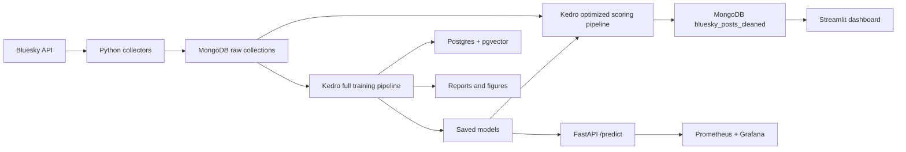
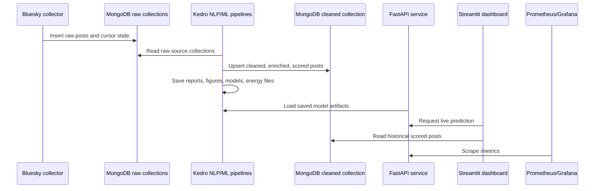
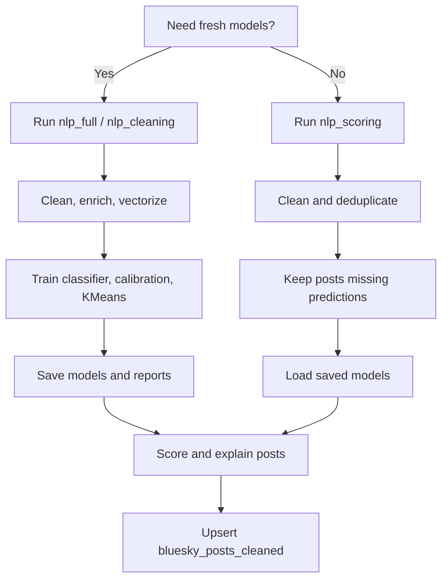
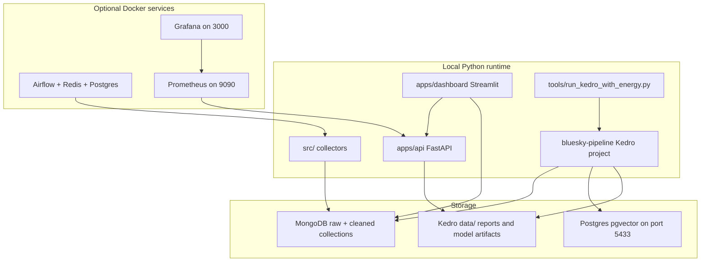
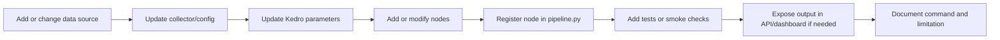

# Projet Thumalien - Detection de Fake News sur Bluesky

This repository is the MVP for the Mastère 1 Data & IA project "Thumalien". It collects Bluesky posts, stores them in MongoDB, cleans and enriches them with NLP, trains baseline fake-news/credibility models, exposes predictions through an API, displays outputs in Streamlit, and tracks energy consumption with CodeCarbon.

The project is designed around the cahier des charges:

- Detect doubtful or misleading Bluesky content.
- Produce a credibility score and an alert flag.
- Analyse sentiment and emotions.
- Explain why a post is considered suspicious or credible.
- Provide a usable dashboard and monitoring/Green IT evidence.

## 1. Architecture



End-to-end operating flow:



Pipeline choice:



Main folders:

- `src/`: Bluesky collection scripts and MongoDB ingestion helpers.
- `bluesky-pipeline/`: Kedro NLP/ML pipelines.
- `apps/api/`: FastAPI scoring service.
- `apps/dashboard/`: Streamlit dashboard.
- `monitoring/`: Prometheus/Grafana setup.
- `tools/`: helper scripts, including CodeCarbon energy tracking.
- `config/app_config.json`: non-secret ingestion settings such as caps and verified handles.

Infrastructure inventory:



The project can run in a lightweight local mode with Python, MongoDB, API, and dashboard. Docker is only needed for optional Airflow orchestration, Prometheus/Grafana monitoring, or the pgvector database used by the full training pipeline.

## 2. Setup

Create/activate the virtual environment, then install dependencies:

```powershell
.venv\Scripts\activate
pip install -r requirements.txt
```

Install the TextBlob/NLTK corpora used by the sentiment/emotion fallback:

```powershell
python -m textblob.download_corpora
python -c "import nltk; nltk.download('punkt_tab')"
```

Secrets must stay local. Put real MongoDB/Postgres/API values in:

- `.env`
- `bluesky-pipeline/conf/local/parameters_nlp_cleaning.yml`

Use `.env.example` as the safe template for required variables. The real `.env`, `.env.*`, and `.streamlit/secrets.toml` files are ignored by Git and must not be committed.

Do not put secrets in `bluesky-pipeline/conf/base/*.yml`, because those files are intended to be committed to GitHub.

## 3. Data Collection

Run the collector from the project root:

```powershell
python src/blueskyToMongoBackfill.py
```

This single collector currently:

- Collects topic posts into `science`, `ukraine`, `news`, and `climate`.
- Collects trusted publisher posts into `verified_news`.
- Uses cursor state in MongoDB `search_state` to avoid constantly refetching the same pages.
- Skips empty posts where `record.text` is empty.
- Avoids duplicates with unique Bluesky `uri` values.
- Applies per-collection caps from `config/app_config.json`.

Current cap strategy:

- `science`, `ukraine`, `news`, `climate`: 15K documents each.
- `verified_news`: 60K documents.

Why `verified_news` is bigger: the four topic collections are treated as the broad "unverified" side, while `verified_news` is the curated credible reference set. This reduces class imbalance for the baseline model.

## 4. Labels and Data Quality

The project does not yet have a perfect manually fact-checked fake-news dataset. Instead, the MVP uses weak supervision:

- `verified_news` -> `credible`
- `science`, `ukraine`, `news`, `climate` -> `unverified`

This is good enough for a demonstrable MVP and for explaining the methodology, but it should be described honestly as a curated credible reference set, not as absolute ground truth.

Recommended future improvement: add manual annotations or an external fact-checking dataset with explicit `fake`, `misleading`, `credible`, and `uncertain` labels.

## 5. Kedro Pipelines

There are now two Kedro run modes.

### 5.1 Full training pipeline

Use this when you want to rebuild everything from scratch: cleaning, vectorization, sentiment/emotions, reports, Postgres vectors, KMeans, classifier training, calibration, predictions, explanations, optional transformer training, and model saving.

```powershell
cd bluesky-pipeline
kedro run --pipeline nlp_full
```

Equivalent legacy name:

```powershell
kedro run --pipeline nlp_cleaning
```

Use this after:

- Major raw data changes.
- Changing vectorizer/model parameters.
- Changing the labeling strategy.
- Wanting a fresh classification report, clusters, or saved model artifacts.

### 5.2 Optimized scoring pipeline

Use this for routine runs after collection. It is much faster because it reuses saved models and only scores posts missing model outputs in `bluesky_posts_cleaned`.

```powershell
cd bluesky-pipeline
kedro run --pipeline nlp_scoring
```

This optimized pipeline still performs text cleaning and deduplication so it can discover new posts, but it skips expensive full-corpus steps:

- No TF-IDF refit.
- No KMeans retraining.
- No Logistic Regression retraining.
- No probability recalibration.
- No Postgres vector rebuild.
- No explanations for already-scored posts.

It only enriches and scores documents that are new or missing `predicted_label` / `explanation_text`.

### 5.3 Quick estimate without changing data

To estimate how many posts would need scoring without writing predictions or updating MongoDB:

```powershell
cd bluesky-pipeline
kedro run --pipeline nlp_scoring --to-nodes filter_posts_for_incremental_scoring_node
```

This reads raw MongoDB collections, cleans/deduplicates text, checks `bluesky_posts_cleaned`, prints the selected count, and stops before sentiment, emotions, scoring, or writes.

With energy tracking:

```powershell
# from the project root
python tools/run_kedro_with_energy.py --estimate-only
```

## 6. What Each Main Node Does

Full pipeline nodes:

- `load_raw_posts`: reads raw MongoDB collections and adds `source_label`.
- `clean_text_node`: lowercases text, removes URLs/mentions/hashtags/punctuation/accents, normalizes spaces.
- `tokenize_and_lemmatize`: uses SpaCy EN/FR models, removes stopwords, keeps alpha tokens.
- `remove_duplicates`: removes exact duplicates based on `clean_text`.
- `derive_credibility_labels`: maps `verified_news` to `credible`, others to `unverified`.
- `vectorize_posts`: fits TF-IDF with configurable n-grams and stopwords.
- `add_sentiment`: computes polarity in range `-1` to `+1`; French uses `textblob-fr` when installed.
- `add_emotions`: uses optional multilingual transformer emotion classification, otherwise NRCLex/TextBlob fallback.
- `compute_sentiment_summary`: writes sentiment summaries to `data/08_reporting`.
- `compute_emotion_summary`: writes emotion summaries to `data/08_reporting`.
- `compute_data_drift_report`: compares label/language distribution with previous runs.
- `store_cleaned_posts_to_mongo`: upserts cleaned documents into MongoDB.
- `store_vectors_to_postgres`: creates the pgvector table if needed and stores TF-IDF vectors.
- `train_kmeans`: creates global and label/language clusters with top TF-IDF terms.
- `train_classifier`: trains the Logistic Regression baseline.
- `calibrate_classifier`: calibrates probabilities for more meaningful confidence scores.
- `generate_predictions`: writes per-post predictions to `data/07_model_output`.
- `build_user_facing_explanations`: creates readable explanation text.
- `store_explanations_to_mongo`: stores top influential terms, score, label, and alert in MongoDB.
- `save_classifier_explanations`: saves top terms per class.
- `generate_reporting_figures`: creates lightweight charts in `data/08_reporting/figures`.
- `train_transformer_model`: optional transformer fine-tuning.
- `save_models`: persists vectorizer, classifier, label encoder, calibrated classifier, and KMeans.

Optimized scoring-only nodes:

- Reuses the cleaning and deduplication nodes.
- `filter_posts_for_incremental_scoring`: keeps only posts missing prediction/explanation outputs.
- `load_saved_models`: loads artifacts from `data/06_models`.
- `transform_posts_with_saved_vectorizer`: transforms new posts without fitting TF-IDF again.
- `score_and_store_incremental_posts`: predicts, explains, and upserts only the selected posts.

## 7. Reading `bluesky_posts_cleaned`

Important fields:

- `uri`: original Bluesky post identifier.
- `source_label`: source collection, for example `verified_news`, `climate`, `news`, `ukraine`, `science`.
- `credibility_label`: weak reference label. Current rule: `verified_news = credible`, others `unverified`.
- `clean_text`: normalized text used by the NLP pipeline.
- `tokens`: SpaCy lemmatized tokens after stopword removal.
- `lang_detected`: detected/declared language, usually `en` or `fr`.
- `sentiment`: TextBlob polarity from `-1` (negative) to `+1` (positive).
- `emotion_scores`: emotion vector. Lexicon mode gives relative frequencies; transformer mode gives model scores.
- `dominant_emotion`: strongest emotion, or `unknown` when no emotion signal is detected.
- `predicted_label`: classifier output, usually `credible` or `unverified`.
- `credibility_score`: confidence-like probability for the predicted class. Close to `1` means confident; near `0.5` means uncertain.
- `alert`: `true` when confidence is below `ALERT_THRESHOLD`.
- `explanation_terms`: top TF-IDF terms influencing the prediction.
- `explanation_text`: readable explanation for dashboard/API users.
- `emotion_status`: `ok`, `missing_text`, `emotion_failed`, or dependency-related fallback status.

The cleaned collection now uses upserts on `clean_text`, so reruns can refresh stale fields instead of silently keeping old labels forever.

## 8. Energy Tracking

Routine optimized energy run:

```powershell
# from the project root
python tools/run_kedro_with_energy.py
```

By default this measures `nlp_scoring`, not the multi-hour full training pipeline.

Full retraining energy run:

```powershell
# from the project root
python tools/run_kedro_with_energy.py --pipeline nlp_full
```

Reports are written to:

```text
bluesky-pipeline/data/08_reporting/energy_report_*.csv
```


## 9. API, Dashboard, Monitoring

Start the API:

```powershell
uvicorn apps.api.main:app --port 8000
```

On Windows/OneDrive, avoid plain `--reload` from the repo root because Uvicorn can scan Airflow log symlinks and crash. If you need reload:

```powershell
uvicorn apps.api.main:app --reload --reload-dir apps --port 8000
```

Verify the API:

- Open `http://127.0.0.1:8000/docs`.
- Open `http://127.0.0.1:8000/health`.
- POST a text example to `/predict` from the Swagger UI.
- Open `http://127.0.0.1:8000/metrics` to inspect Prometheus metrics.

Main API endpoints:

- `GET /health`: returns service status for the dashboard and monitoring.
- `POST /predict`: scores one text input and returns `predicted_label`, `credibility_score`, class probabilities, sentiment, emotion scores, explanation terms, explanation text, and `alert`.
- `GET /metrics`: exposes Prometheus metrics such as request count and latency.

The `/predict` endpoint scores text only. The Streamlit dashboard can optionally fetch text from a public `bsky.app` post URL, then sends that text to `/predict`.

Start the dashboard:

```powershell
streamlit run apps/dashboard/app.py
```

The dashboard uses a minimalist black/royal-purple theme and has four tabs:

- `Predict`: paste a Bluesky post text and get live model output from the FastAPI service.
- `Stored posts`: browse scored MongoDB records from `bluesky_posts_cleaned` when pipeline data exists.
- `Monitoring`: check API health and Prometheus metrics.
- `Green IT`: read the latest CodeCarbon energy report.

The dashboard loads `.env` automatically from the project root. It still works for live prediction when MongoDB is empty, as long as the FastAPI service is running.

Dashboard controls:

- `FastAPI URL`: shown inside `Predict` and `Monitoring`; it points to the running FastAPI service, usually `http://127.0.0.1:8000`.
- `Source labels`: shown inside `Stored posts`; it lets you query the five project source groups: `verified_news`, `climate`, `news`, `ukraine`, and `science`.
- `Analysis sample per source`: shown inside `Stored posts`; it loads this many recent cleaned/scored posts for each selected source. This prevents MongoDB sort memory errors on large collections.

How to read `Predict`:

- `Decision`: `Pass` means predicted `credible` and confidence is above `ALERT_THRESHOLD`; `Review` means confidence is below `ALERT_THRESHOLD`; `Reject` means predicted `unverified` with confidence above the threshold.
- `Bluesky post URL`: optional helper that fetches public post text from a `bsky.app/profile/.../post/...` URL before prediction.
- `Use credible demo text` and `Use unverified demo text`: quick examples for presenting both model outcomes without needing to type new text.
- `Model confidence`: probability of the predicted class, shown from `0%` to `100%`.
- `Sentiment`: TextBlob polarity from `-1` to `+1`; below `-0.20` is negative/red, between `-0.20` and `+0.20` is neutral/orange, above `+0.20` is positive/green.
- `Class probabilities`: compares the model probability for each class.
- `Emotion signals`: lexicon emotion scores. Red is used for negative emotions, green for positive emotions, purple for neutral/other signals.

How to read `Stored posts`:

- This tab reads already-cleaned/scored posts from MongoDB. It is historical pipeline output, not a live API prediction.
- `source_label` comes from the raw source collection. The tab queries the cleaned collection separately for each selected source, so charts can compare `verified_news`, `climate`, `news`, `ukraine`, and `science` when those sources have been scored.
- If a selected source returns no rows, that source likely has not been scored into `bluesky_posts_cleaned` yet; rerun the collector and `kedro run --pipeline nlp_scoring`.
- The dashboard keeps only `fr` and `en` rows in this tab because the project scope is French/English.
- Charts use the loaded recent EN/FR sample for each selected source. Comparing entire collections would be interesting, but large sorted MongoDB queries can exceed the in-memory sort limit unless the collection has the right index or the query is handled as an offline aggregation.
- `Sentiment by source` compares average sentiment per source label; `Sentiment by language` compares French and English.
- `Emotion distribution` counts posts by their strongest detected emotion after filters. `unknown` means no emotion signal was found or emotion enrichment failed.
- `Latest scored posts` is capped to the 100 most recent rows after filters so the table remains readable. The `Dominant emotion` filter chips and table column are color-coded: green for positive emotions, red for negative emotions, and purple for neutral/unknown signals.

How to read `Monitoring`:

- `API requests`: cumulative request count exposed by Prometheus since the API process started.
- `Avg latency`: estimated average API response time in seconds, calculated as Prometheus latency sum divided by latency count.
- Raw `/metrics` output is shown for debugging or Grafana/Prometheus verification.

How to read `Green IT`:

- CodeCarbon values are estimates for documenting and comparing runs, not billing-grade measurements.
- `duration`: seconds.
- `emissions`: kg CO2 equivalent.
- `emissions_rate`: kg CO2 equivalent per second. Very small values may display as `0.0000` when rounded.
- `cpu_power`, `gpu_power`, `ram_power`: watts.
- `cpu_energy`, `gpu_energy`, `ram_energy`, `energy_consumed`: kWh.
- `ram_total_size`: GB.
- `pue`: ratio.

Start monitoring:

```powershell
cd monitoring
docker compose up -d
```

Open Grafana at `http://localhost:3000` (`admin` / `admin`).

Airflow is not required to run the API, dashboard, or monitoring. Airflow is only useful if you want orchestration/scheduling.

Recommended order:

1. Start Docker services if you need Postgres/Airflow/monitoring.
2. Run `python src/blueskyToMongoBackfill.py` to collect new posts.
3. Run `kedro run --pipeline nlp_scoring` for routine scoring, or `nlp_full` for full retraining.
4. Start API with Uvicorn.
5. Start Streamlit dashboard.
6. Start Prometheus/Grafana if you want metrics.

Emotion interpretation note: the current API fallback uses a lexicon-based detector. If the text does not contain words recognized by that lexicon, all emotion scores are `0` and the dominant emotion is `unknown`. This is expected for very short or neutral inputs.

## 10. Postgres / pgvector

The full pipeline creates the `posts_vectors` table automatically if it does not exist. You do not need to recreate it manually in DBeaver after dropping it.

The table is only populated by the full pipeline, not by `nlp_scoring`. This is intentional: routine scoring should be fast and should not rebuild vector storage.

## 11. Drift and Retention

Retention/capping controls storage size. Drift monitoring checks whether label/language distributions change between runs. These are related but not the same:

- Capping prevents MongoDB free-tier storage from growing forever.
- Drift reports tell you whether the incoming data distribution is changing.
- Real drift should be handled with monitoring and periodic retraining.

Run a full retraining periodically, for example weekly or after large collection changes, to refresh model behavior.

## 12. Project Coverage

Covered:

- Bluesky collection EN/FR.
- MongoDB raw storage.
- Clean NLP preprocessing.
- Baseline fake-news/credibility classifier.
- Calibrated confidence scores and alert threshold.
- Sentiment and emotion analysis.
- Per-post explanations.
- Streamlit dashboard with live prediction, stored scored posts, monitoring, and Green IT tabs.
- FastAPI inference through `/predict`.
- Prometheus/Grafana monitoring hooks through `/metrics`.
- CodeCarbon energy tracking shown in the dashboard when reports exist.
- Data drift reporting.
- CI/CD baseline workflow.

## 13. Tests and Quality Checks

Current automated checks:

- GitHub Actions installs root, app, and Kedro dependencies on Python 3.11.
- CI compiles `src`, `bluesky-pipeline/src`, and `apps` with `python -m compileall`.
- CI runs `pytest tests -q` inside `bluesky-pipeline` when tests are present.
- The existing Kedro test verifies that the Kedro project bootstraps and loads its context.

Useful local commands:

```powershell
# Compile Python modules from the project root
python -m compileall src bluesky-pipeline/src apps

# Run the current Kedro tests
cd bluesky-pipeline
pytest tests -q

# Run tests with the coverage options from pyproject.toml
pytest
```

Current test gap: the repository does not yet have strong unit tests for collection, text cleaning, scoring, API responses, dashboard helpers, or Mongo/Postgres writes. The current tests are useful as smoke tests, but they should not be presented as full model or application validation.

Recommended next tests:

- Unit tests for `clean_text_node`, `derive_credibility_labels`, `remove_duplicates`, and incremental scoring filters.
- API tests for empty text, missing model artifacts, and a successful `/predict` response using small mocked models.
- Dashboard helper tests for metric parsing, label probability mapping, and status decisions.
- Integration smoke test that runs the scoring path against a tiny fixture dataset and a temporary/local test database.

## 14. How to Extend the Project

Use this path when adding a new capability:



Extension checklist:

- New raw source: add collection settings in `config/app_config.json`, update collection logic in `src/`, and include the collection in `RAW_COLLECTIONS`.
- New trusted source: add the handle to `verified_handles` and keep `VERIFIED_SOURCES` aligned with the MongoDB collection used as the credible reference.
- New NLP feature: implement it as a Kedro node in `bluesky-pipeline/src/bluesky_pipeline/pipelines/nlp_cleaning/nodes.py`, wire it in `pipeline.py`, and store the resulting field in MongoDB if the dashboard/API needs it.
- New model: add parameters in `conf/base/parameters_nlp_cleaning.yml`, save artifacts in `data/06_models`, and update `apps/api/main.py` only after the artifact contract is stable.
- New dashboard view: prefer reading already-scored MongoDB fields or API outputs, keep expensive aggregation in Kedro/offline reports, and document any sampling choice.
- New monitoring metric: expose it from FastAPI `/metrics`, then update Prometheus/Grafana configuration under `monitoring/`.

Before changing labels or model logic, rerun `nlp_full`. For display-only or incremental scoring changes, `nlp_scoring` is usually enough after models already exist.

## 15. Known Limitations

Current limitations:

- The credible class is curated from trusted publishers, not a perfect manually verified truth dataset.
- The unverified class does not necessarily mean fake; it means "not from the trusted reference set".
- Transformer fine-tuning is implemented as optional but still needs stronger benchmarking before being treated as production quality.
- Emotion analysis should be validated more carefully, especially for French and short social posts.
- The API depends on saved model artifacts in `data/06_models`; run `nlp_full` before relying on `/predict` in a fresh clone.
- The scoring pipeline reuses existing models, so it will not learn new vocabulary or behavior until a full retraining is run.
- Dashboard charts use recent samples from MongoDB to stay responsive; they are operational views, not full statistical reports over every stored post.
- CodeCarbon metrics are estimates for comparison and reporting, not billing-grade carbon measurements.
- Airflow is local-development orchestration only in this repository, not a production deployment.

## 16. Useful Commands

```powershell
# Collector
python src/blueskyToMongoBackfill.py

# Full model rebuild
cd bluesky-pipeline
kedro run --pipeline nlp_full

# Fast routine scoring
kedro run --pipeline nlp_scoring

# Estimate new posts without writes
kedro run --pipeline nlp_scoring --to-nodes filter_posts_for_incremental_scoring_node

# Return to project root for app/tool commands
cd ..

# Energy tracking for optimized scoring
python tools/run_kedro_with_energy.py

# Energy tracking for full rebuild
python tools/run_kedro_with_energy.py --pipeline nlp_full

# API
uvicorn apps.api.main:app --port 8000

# Dashboard
streamlit run apps/dashboard/app.py

# Monitoring
cd monitoring
docker compose up -d
```
